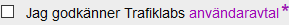

# Creating an account

Your Trafiklab account will allow you to create projects and API keys.


Disable browser plugins like Google Translate when creating an account. They are known to cause issues when logging in, creating accounts and creating projects.


To start, go [the account creation page](https://www.trafiklab.se/user/register).

You need to fill in a valid mail address and username. This mail address will be used to contact you if we make changes to an API you are using. Your email address will not be made public.

Accept the terms and conditions

And confirm you're not a robot

Hit the submit button, and you will receive a one-time login link in your email. Using this link you can login and choose a password.

